<h3><code>lehi@github ~ $ ./contributions.sh</code></h3>

 
 

<h3><code>lehi@github ~ $ whoami</code></h3>

<table>
  <tr>
    <td valign="top"></td>
    <td valign="top"></td>
  </tr>
</table>

 

<h3>Lehi Salvador</h3>

<b>Founder of Salva Systems · AI &amp; Automation Builder</b>

I build business software that connects AI, web applications and real-world operations.

<a href="https://salvasystems.site"><b>Salva Systems</b></a> &nbsp; / &nbsp; <a href="https://github.com/LehiSalvador?tab=repositories"><b>Explore my work</b></a>

 

### `lehi@github ~ $ cat stack.txt`

**Next.js · React · TypeScript · Supabase · Vercel** 
AI APIs · WhatsApp automation · SaaS products · Operational dashboards

### `lehi@github ~ $ ls projects/`

| Project | What I'm building |
| :--- | :--- |
| [SALVAOPS](https://github.com/LehiSalvador/SALVAOPS) | A workspace for AI-assisted development, project context and operations. |
| [Salva Web Invitations](https://github.com/LehiSalvador/salva-web-invitations) | Premium digital invitations built as elegant web experiences. |
| [ArchivoSteam](https://github.com/LehiSalvador/ArchivoSteam) | A web product built with TypeScript. [Live project](https://archivo-steam-platform.vercel.app). |
| [RUNIIS](https://github.com/LehiSalvador/RUNIIS) | A TypeScript web application. [Live project](https://runiis-web.vercel.app). |

**Also building:** Orquest System for WhatsApp AI and customer service; Aplomo Systems for industrial operations, inventory and logistics. 
**Exploring:** Viorumbo, a personal health app concept focused on habits, metrics and guidance.

### `lehi@github ~ $ ./connect.sh`

Business systems, automation or a new digital product? Visit **[salvasystems.site](https://salvasystems.site)**.

About this animated profile

The Salva Systems logo is generated from the original brand artwork. The calendar and statistics use real public GitHub contribution data and refresh daily with GitHub Actions. Animations live inside self-contained SVG files and respect reduced-motion preferences. Streaks and monthly totals describe the displayed calendar period.

[Maintenance guide](./docs/MAINTENANCE.md) · [Refresh workflow](./.github/workflows/update-profile.yml)

Visual inspiration: [Avi Vashishta's animated profile](https://www.avivashishta.com/blog/build-animated-github-profile-readme). Scripts and artwork generation written for this profile.

