# Lehi Salvador

**Founder · Product & Project Lead de Salva Systems**

Transformo necesidades de negocio en productos digitales y soluciones para operaciones.

<a href="https://salvasystems.site"><b>Salva Systems</b></a> &nbsp; · &nbsp; <a href="#proyectos"><b>Proyectos</b></a> &nbsp; · &nbsp; <a href="#contacto"><b>Contacto</b></a>

  
  

## Sobre mí

Mi trabajo conecta producto, tecnología y operación: identifico necesidades, defino procesos y reglas de negocio, diseño soluciones funcionales y coordino desarrollo, pruebas e implementación con usuarios.

He liderado proyectos de trazabilidad industrial, automatización empresarial, manufactura, identidad profesional y eventos deportivos. Me interesa construir herramientas útiles, con interfaces claras y resultados verificables en su contexto de uso.

## Salva Systems

Empresa de tecnología fundada en **marzo de 2026**, enfocada en digitalización, automatización y software empresarial. Es el ecosistema desde el que desarrollo productos como **Aplomo System, ATENOR System y Careertrackly**.

[Conoce Salva Systems](https://salvasystems.site) · [Presentación de la empresa](https://github.com/LehiSalvador/SalvaSystems)

## Proyectos

| Proyecto | Solución y avance |
| :--- | :--- |
| **[Aplomo System](https://github.com/LehiSalvador/AplomoSystem)** | Trazabilidad de materiales y flujo de camiones en patios industriales. Proyecto contratado, febrero–julio de 2026; lideré equipo de **siete integrantes**. **3.er lugar general en ExpoIngenierías 2026, Tecnológico de Monterrey.** |
| **[ATENOR System](https://github.com/LehiSalvador/ATENORSystem)** | SaaS multinegocio para WhatsApp, conversaciones, clientes, pedidos, operación e IA configurable. Desde marzo de 2026; aproximadamente **cuatro implementaciones activas** en el sur de Tamaulipas. |
| **[Careertrackly](https://github.com/LehiSalvador/careertrackly-product)** | Identidad profesional basada en proyectos, habilidades y evidencia. Arquitectura conceptual V1 definida; desarrollo funcional inicial. |
| **[UFlex Woven Bags](https://github.com/LehiSalvador/UFlexWovenBags)** | Registro de producción, desperdicio, paros y trazabilidad histórica en manufactura. Desde agosto de 2026; aplicación funcional V1 en **C#/.NET/WPF**, en desarrollo. |
| **[SalvaOps](https://github.com/LehiSalvador/SALVAOPS)** | Workspace para Windows y orquestación de agentes de IA: proyectos, contexto, Skills, MCPs, integraciones, evidencia y auditoría. Base operativa V1; evolución continua. |
| **[RUNIIS](https://github.com/LehiSalvador/RUNIIS)** | Plataforma para descubrir, configurar y operar eventos deportivos: inscripciones, pases QR, check-in y comunicación. En desarrollo. [Sitio del proyecto](https://runiismty.com). |
| **[Archivo STEAM](https://github.com/LehiSalvador/ArchivoSteam)** | Un archivo vivo de personas, ideas y experiencias. Iniciativa de conocimiento con identidad, narrativa y presentación desarrolladas; producto en evolución. |

## Tecnologías

**Web y producto:** React, TypeScript, Next.js, Vite y Capacitor. 
**Datos y despliegue:** Supabase, PostgreSQL, GitHub y Vercel. 
**Operación industrial:** C#, .NET, WPF, Leaflet/OpenStreetMap, QR y NFC. 
**Automatización e IA:** WhatsApp, Claude Code, Codex, agentes, Skills y MCPs.

## Contribuciones públicas

  

## Contacto

Para proyectos de digitalización, automatización o software empresarial: **[salvasystems.site](https://salvasystems.site)**.

Acerca de este perfil

Logo generado desde identidad oficial de Salva Systems. Calendario y estadísticas muestran datos públicos de GitHub; se actualizan diariamente. Rachas y totales describen período del calendario mostrado. Los tres gráficos tienen marcos de fuego en pixel art con 16 fotogramas distintos en bucle. Una onda luminosa recorre el calendario mientras el perfil está abierto. Con movimiento reducido, el fuego queda estático y se desactivan desplazamientos y efectos de entrada; la onda sigue visible y las cifras permanecen estables.

[Guía de mantenimiento](./docs/MAINTENANCE.md) · [Actualización automática](./.github/workflows/update-profile.yml)

Inspiración visual: [perfil animado de Avi Vashishta](https://www.avivashishta.com/blog/build-animated-github-profile-readme). Scripts y gráficos desarrollados para este perfil.

